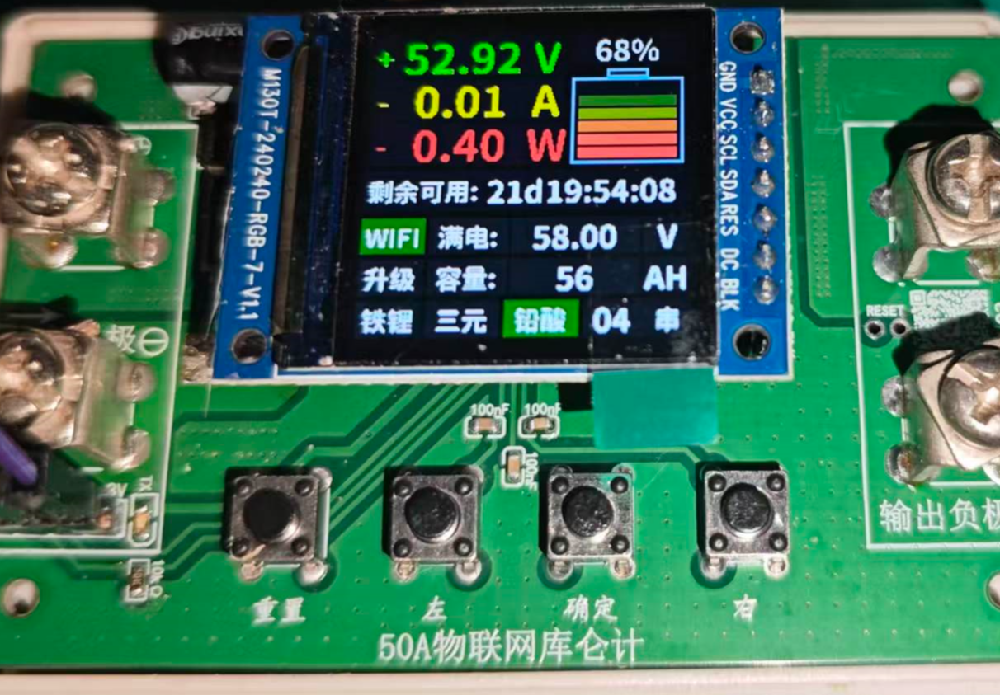
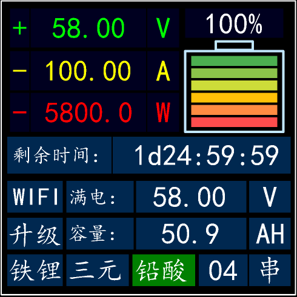
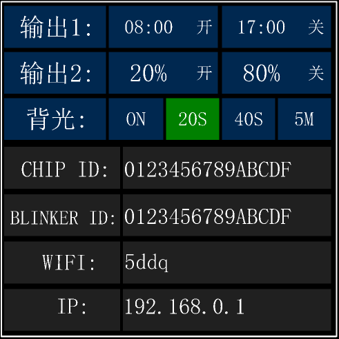
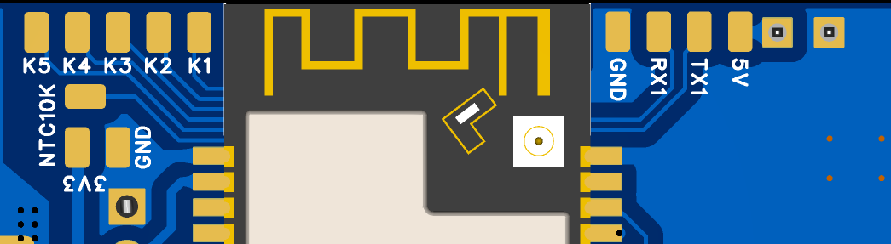
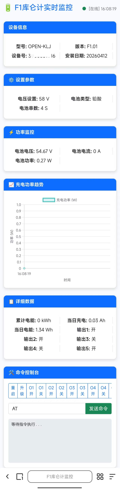
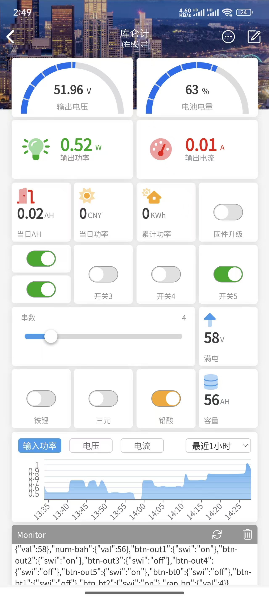
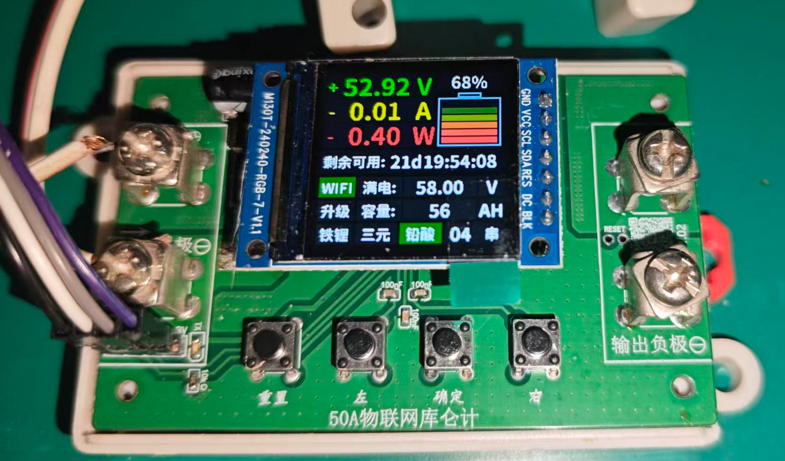

# F1_ESP32库仑计_远程开关_功率计

## 简介

### 采用ESP32制作的库仑计、远程开关、功率计；可以用于远程电池组监测、功率监测、远程开关、电池保护板数据远程读取。

简介：

采用ESP32制作的库仑计、远程开关、功率计；可以用于远程电池组监测、功率监测、远程开关、电池保护板数据远程读取。

复刻成本：

￥*45*

## 开源协议

：

### LGPL 2.1

(未经作者授权，禁止转载)

创建时间：2026-04-12 15:38:39

更新时间：2026-04-20 17:25:10

## 描述

## 项目简介

采用ESP32制作的库仑计、远程开关、功率计；可以用于远程电池组监测、功率监测、远程开关、电池保护板数据远程读取。
 QQ交流群（我的电路板基地）：7118001

## 项目参数

- 输入电压：12 ~ 96.0V
- 输出电压：12 ~ 96.0V
- 输出电流：0 ~ 80.0A
- 远程开关：5路
- 串口读取：1路
- 温度监控：1路
- 功率累计：当日AH、当日功率、累计功率
- 取样电阻：1mΩ:最大80A; 2mΩ:最大40A; 4mΩ 最大20A

## 更新记录

- 20260412 增加5路开关和一路串口, 升级固件
- 20240419 修正TFT使用的GPIO口问题

## 操作屏说明

**1. 主工作页面**

- 电压、电流、功率、电量
- 根据负载，计算出电池剩余可用时长
- 网络状态、电池满电电压、容量
- 在线固件升级
- 电池组电池类型设置、电池组串数设置

**2. 配置页面**

- 输出1:根据时间自动开关参数配置
- 输出2:根据电量自动开关参数配置
- 背光显示时长参数配置
- 基础信息显示

**3. 扩展接口**

- K1 K2 K3 K4 K5 接常见的继电器模块，可以控制5路开关
- NTC10k 接一个10K的3950温度传感器、可监控电池组的温度
- 5V TX1 RX1 GND 接电池保护板的串口（TTL直连，若RS485的AB口需外加转接板），可以远程监控保护板数据
- 最右侧的两个焊点 可以接锂电池，当电池组断电保护时，可确保供电稳定不掉线

**4. ESP32热点离线监控**

**5. ESP32连接网络可以在线远程监控**

**5.串口接线说明 **

- RX 接CH340的 TX
- TX 接CH340的 RX
- 波特率采用115200
- 下载时先按住“确定”键，再点按一次“重置”按键，进入ESP32的下载模式

## 操作提示

固件下载，若焊接了ST7789屏幕，常规下载工具会因供电不足，下载失败，需独立3.3v供电或用开源下载器：[https://oshwhub.com/q12888873/usb_ttl_ch340n_sti3470](https://oshwhub.com/q12888873/usb_ttl_ch340n_sti3470)

## 点灯配置界面

## 实物图

## 

|          |      |      |
| --- | --- | --- |
| 暂无数据 |||

## 附件

| 序号 | 文件名称 | 下载次数 |
| --- | --- | --- |
| 1 | 点灯配置.txt | 23 |
| 2 | 固件_KLJ_ST7789_F1.01.bin | 16 |

